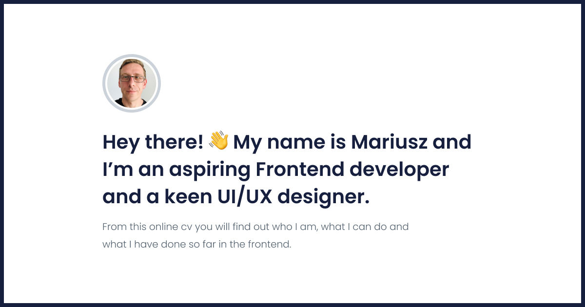

# PrzybylskiMariusz
During the creation of this project I was able to use all the knowledge gained during the course: "WTF: CO ten Frontend?" If you want to know what tools I used, read on and be sure to visit my website [HERE](https://przybylskimariusz.github.io/project-gulp/).

## Used tools and technologies

|  HTML 	|   CSS	|  JavaScript 	|
|---	|---	|---	|
|   BEM	| Sass 	|  Fetch API 	|
|  Semanctic HTML 	|  Nested styles 	|  Event Listener 	|
|   	|  @keyframe 	|   	|
|   	|  Media queries 	|   	|
|   	|  Variables in Sass 	|   	|

## Local launch

To run my site on a local server, follow these steps:

`npm install -g gulp-cli`

`npm install`

`gulp`
